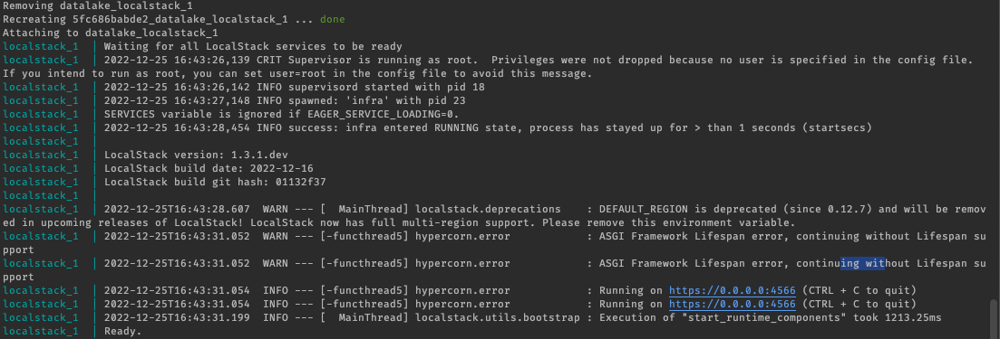
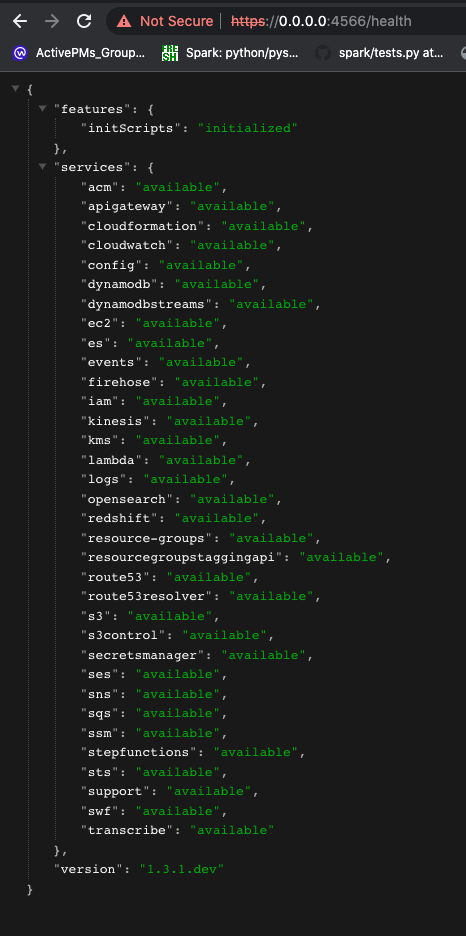

# datalake

## prerequisites

- [localstack](https://localstack.cloud/)
- [docker](https://www.docker.com/)
- [awscli-local](https://github.com/localstack/awscli-local)


## env setup

### [localstack](https://localstack.cloud/)

```shell
docker-compose -f docker-compose-aws.yml up -d
```

Once the docker-compose runs successfully then you should see something like this:



You can test it my hitting `localhost:4566/health` and the results should look like this:



Now lets see if we can really create buckets in the localstack s3:

Install awscli-local by running:

`pip3.7 install awscli-local (assuming you have pip installed)`

```shell
create bukcet:

awslocal s3 mb s3://test
 > make_bucket: test

upload test file to s3

awslocal s3 cp test.txt s3://test
 > upload: ./test.txt to s3://test/test.txt

check if its uploaded:

awslocal s3 ls s3://test
 > 2022-12-25 22:18:44         10 test.txt
```