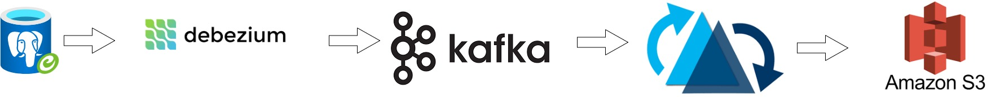

# In-House Data Lake with CDC Processing and Apache Hudi

Welcome to the In-House Data Lake project! This comprehensive data lake solution empowers organizations to efficiently
manage and process data in real-time. It seamlessly captures Change Data Capture (CDC) records from PostgreSQL using
Debezium, streams them to Apache Kafka with Schema Registry, and performs incremental data processing with Apache Hudi.
Finally, it stores the processed data in a local instance of AWS S3 powered by Localstack. The entire setup is
containerized with Docker for easy deployment, and it requires Docker and Apache Spark 3.4 installed as prerequisites.



## Table of Contents

- [Prerequisites](#prerequisites)
- [Getting Started](#getting-started)
- [Project Structure](#project-structure)


## Prerequisites

Before you begin, ensure you have the following prerequisites installed on your system:

- Docker
- Apache Spark 3.4
- [awscli-local](https://github.com/localstack/awscli-local)
   ```bash
  Install awscli-local by running:

   pip3.7 install awscli-local (assuming you have pip installed)

   create bukcet if we want hudi to write data in s3:
   
   awslocal s3 mb s3://hudi-demo-bucket/hudidb/
   > make_bucket: hudi-demo-bucket
   
  ```

## Getting Started

To get started with this project, follow these steps:

1. Clone the repository:
   ```bash
   git clone git@github.com:Rahul7794/datalake.git
   cd datalake

2. Build and run the Docker containers:
   ```bash
   cd hudi-datalake
   docker-compose up -d
   ```
3. Once the docker containers are up and running, one should be able to view the containers by:
   ```bash
   docker ps
   ```
   List of containers looks like this:
   
4. Now It's time to run the debezium postgres connectors which dumps cdc changes to kafka topics
   ```bash
   curl -H 'Content-Type: application/json' localhost:8083/connectors --data '
   {
   "name": "transactions-connector",
   "config": {
   "connector.class": "io.debezium.connector.postgresql.PostgresConnector",
   "database.hostname": "hudidb",
   "plugin.name": "pgoutput",
   "database.port": "5432",
   "database.user": "postgres",
   "database.password": "root123",
   "database.dbname" : "dev",
   "topic.prefix": "test",
   "database.server.name": "test1",
   "schema.include.list": "v1"
    }
   }'
   ```
   | Property                       | Description                                                       | Example Value         |
      |---------------------------------|-------------------------------------------------------------------|-----------------------|
   | `name`                          | Name of the connector, unique within Kafka Connect.               | `transactions-connector` |
   | `connector.class`               | Class of the connector to be used (Debezium connector for PostgreSQL). | `io.debezium.connector.postgresql.PostgresConnector` |
   | `database.hostname`             | Hostname of the PostgreSQL database server.                        | `hudidb`               |
   | `plugin.name`                   | Name of the PostgreSQL plugin to be used for capturing changes.    | `pgoutput`             |
   | `database.port`                 | Port on which the PostgreSQL database is listening.                | `5432`                  |
   | `database.user`                 | Username to connect to the PostgreSQL database.                    | `postgres`              |
   | `database.password`             | Password for the PostgreSQL user.                                  | `root123`               |
   | `database.dbname`               | Name of the PostgreSQL database from which change data should be captured. | `dev`                   |
   | `topic.prefix`                  | Prefix for Kafka topics to which change data will be streamed.     | `test`                  |
   | `database.server.name`          | Unique name for this database server (used as a namespace for Kafka topics). | `test1`                 |
   | `schema.include.list`           | Schema(s) within the database to monitor for changes.              | `v1`                    |

5. Now verify the topic information by running below command:
   ```bash
   docker run --tty \
   --network psql-kafka_default \
   confluentinc/cp-kafkacat \
   kafkacat -b kafka:9092 -C \
   -s key=s -s value=avro \
   -r http://schema-registry:8081 \
   -t test1.v1.retail_transactions
   ```
6. Once the data is in kafka topic, we can now run the hudi deltastreamer which takes cdc changes from kafka and
   performs a continuous incremental processing and dumps processed data to defined location(localfolder/s3). <br>
   After verfiying spark version and downloading jar in the location `utilities-jar` by downloading the jar from the url
   mentioned in `utilities-jar/jar.txt`

   ```bash
   spark-submit \
   --class org.apache.hudi.utilities.deltastreamer.HoodieDeltaStreamer \
   --packages org.apache.hudi:hudi-spark3.4-bundle_2.12:0.14.0 \
   --properties-file config/spark-config.properties \
   --master 'local[*]' \
   --executor-memory 1g \
   utilities-jar/hudi-utilities-slim-bundle_2.12-0.14.0.jar \
   --table-type COPY_ON_WRITE \
   --target-base-path file:///Users/rahul/PythonWorkSpace/datalake/hudidb/  \
   --target-table retail_transactions \
   --source-ordering-field tran_date \
   --source-class org.apache.hudi.utilities.sources.debezium.PostgresDebeziumSource \
   --payload-class org.apache.hudi.common.model.debezium.PostgresDebeziumAvroPayload \
   --op UPSERT \
   --continuous \
   --source-limit 4000000 \
   --min-sync-interval-seconds 20 \
   --hoodie-conf bootstrap.servers=localhost:9092 \
   --hoodie-conf schema.registry.url=http://localhost:8081 \
   --hoodie-conf hoodie.deltastreamer.schemaprovider.registry.url=http://localhost:8081/subjects/test1.v1.retail_transactions-value/versions/latest \
   --hoodie-conf hoodie.deltastreamer.source.kafka.value.deserializer.class=io.confluent.kafka.serializers.KafkaAvroDeserializer \
   --hoodie-conf hoodie.deltastreamer.source.kafka.topic=test1.v1.retail_transactions \
   --hoodie-conf auto.offset.reset=earliest \
   --hoodie-conf hoodie.datasource.write.recordkey.field=tran_id \
   --hoodie-conf hoodie.datasource.write.partitionpath.field=store_city \
   --hoodie-conf hoodie.datasource.write.keygenerator.class=org.apache.hudi.keygen.SimpleKeyGenerator \
   --hoodie-conf hoodie.datasource.write.hive_style_partitioning=true \
   --hoodie-conf hoodie.datasource.write.precombine.field=tran_date
   ```
   **Command explanation**

| Property                              | Description                                     | Example Value                                      |
|---------------------------------------|-------------------------------------------------|----------------------------------------------------|
| `--class`                             | Main class to be executed with Spark.            | `org.apache.hudi.utilities.deltastreamer.HoodieDeltaStreamer` |
| `--packages`                          | Comma-separated list of packages to be used by Spark. | `org.apache.hudi:hudi-spark3.4-bundle_2.12:0.14.0` |
| `--properties-file`                   | Path to the properties file containing Spark configuration. | `config/spark-config.properties`                 |
| `--master`                            | Specifies the Spark master URL.                  | `'local[*]'`                                       |
| `--executor-memory`                   | Amount of memory to allocate per executor.       | `1g`                                               |
| `<utilities-jar>`                    | Path to the Hudi utilities JAR file.             | `utilities-jar/hudi-utilities-slim-bundle_2.12-0.14.0.jar` |
| `--table-type`                        | Type of the Hudi table (COPY_ON_WRITE or MERGE_ON_READ). | `COPY_ON_WRITE`                                |
| `--target-base-path`                  | Base path where the Hudi dataset will be stored. | `file:///Users/rahul/PythonWorkSpace/datalake/hudidb/` |
| `--target-table`                      | Name of the target Hudi table.                   | `retail_transactions`                              |
| `--source-ordering-field`             | Field used for ordering incoming records.        | `tran_date`                                      |
| `--source-class`                      | Source class for reading data (e.g., Debezium source). | `org.apache.hudi.utilities.sources.debezium.PostgresDebeziumSource` |
| `--payload-class`                     | Class for parsing the payload (e.g., Debezium Avro payload). | `org.apache.hudi.common.model.debezium.PostgresDebeziumAvroPayload` |
| `--op`                                | Operation type (e.g., UPSERT).                   | `UPSERT`                                         |
| `--continuous`                        | Indicates continuous streaming mode.             | (Flag, no value)                                 |
| `--source-limit`                      | Maximum number of records to read from the source. | `4000000`                                      |
| `--min-sync-interval-seconds`         | Minimum sync interval in seconds.                | `20`                                             |
| `--hoodie-conf`                       | Various Hudi configuration properties. Multiple flags can be used with different properties. | (Multiple properties, see examples below) |
| `bootstrap.servers`                   | Kafka bootstrap servers for connecting to Kafka. | `localhost:9092`                                |
| `schema.registry.url`                 | URL for the Avro Schema Registry.               | `http://localhost:8081`                         |
| `hoodie.deltastreamer.schemaprovider.registry.url` | URL for the schema provider in DeltaStreamer. | `http://localhost:8081/subjects/test1.v1.retail_transactions-value/versions/latest` |
| `hoodie.deltastreamer.source.kafka.value.deserializer.class` | Kafka Avro deserializer class. | `io.confluent.kafka.serializers.KafkaAvroDeserializer` |
| `hoodie.deltastreamer.source.kafka.topic` | Kafka topic for source data.                | `test1.v1.retail_transactions`                  |
| `auto.offset.reset`                   | Kafka offset reset strategy.                    | `earliest`                                       |
| `hoodie.datasource.write.recordkey.field` | Field in the record used as the record key.   | `tran_id`                                        |
| `hoodie.datasource.write.partitionpath.field` | Field used for partitioning the data.       | `store_city`                                     |
| `hoodie.datasource.write.keygenerator.class` | Key generator class for Hudi.               | `org.apache.hudi.keygen.SimpleKeyGenerator`     |
| `hoodie.datasource.write.hive_style_partitioning` | Enable Hive-style partitioning.           | `true`                                           |
| `hoodie.datasource.write.precombine.field` | Field for pre-combining records.           | `tran_date`                                      |

   The above writes the data to localfolder mentioned in `--target-base-path` <br>

   If we want to dump records to localstack s3 we need pass few extra properties information mentioned in `config/spark-config-s3.properties` and the spark submit commands will change slightly:

   ```bash
   spark-submit \
   --class org.apache.hudi.utilities.streamer.HoodieStreamer \
   --packages 'org.apache.hudi:hudi-spark3.4-bundle_2.12:0.14.0,org.apache.hadoop:hadoop-aws:3.3.2' \
   --repositories 'https://repo.maven.apache.org/maven2' \
   --properties-file config/spark-config-s3.properties \
   --master 'local[*]' \
   --executor-memory 1g \
   utilities-jar/hudi-utilities-slim-bundle_2.12-0.14.0.jar \
   --table-type COPY_ON_WRITE \
   --target-base-path s3a://hudi-demo-bucket/hudidb/  \
   --target-table retail_transactions \
   --source-ordering-field tran_date \
   --source-class org.apache.hudi.utilities.sources.debezium.PostgresDebeziumSource \
   --payload-class org.apache.hudi.common.model.debezium.PostgresDebeziumAvroPayload \
   --op UPSERT \
    --continuous \
    --source-limit 4000000 \
    --min-sync-interval-seconds 20 \
   --hoodie-conf bootstrap.servers=localhost:9092 \
   --hoodie-conf schema.registry.url=http://localhost:8081 \
   --hoodie-conf hoodie.deltastreamer.schemaprovider.registry.url=http://localhost:8081/subjects/test1.v1.retail_transactions-value/versions/latest \
   --hoodie-conf hoodie.deltastreamer.source.kafka.value.deserializer.class=io.confluent.kafka.serializers.KafkaAvroDeserializer \
   --hoodie-conf hoodie.deltastreamer.source.kafka.topic=test1.v1.retail_transactions \
   --hoodie-conf auto.offset.reset=earliest \
   --hoodie-conf hoodie.datasource.write.recordkey.field=tran_id \
   --hoodie-conf hoodie.datasource.write.partitionpath.field=store_city \
   --hoodie-conf hoodie.datasource.write.keygenerator.class=org.apache.hudi.keygen.SimpleKeyGenerator \
   --hoodie-conf hoodie.datasource.write.hive_style_partitioning=true \
   --hoodie-conf hoodie.datasource.write.precombine.field=tran_date
   ```

8. Monitor the data flow and storage under the path mentioned in `--target-base-path`

## Project Structure

```bash
├── commands.txt
├── config
│   ├── spark-config-s3.properties
│   └── spark-config.properties
├── hudi-datalake
│   ├── connector.json
│   ├── docker-compose.yml
│   ├── dockerfile
│   └── init.sh
├── readme.md
├── screenshots
│   └── dockerps.png
└── utilities-jar
    └── jar.txt
```


